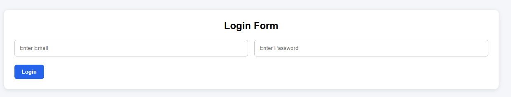
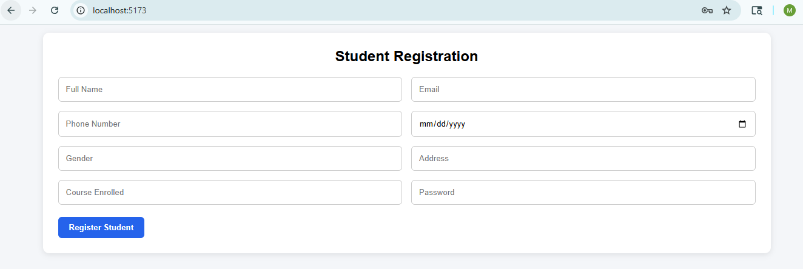
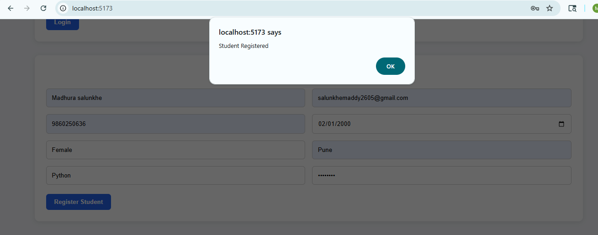
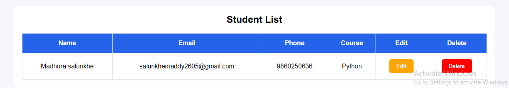
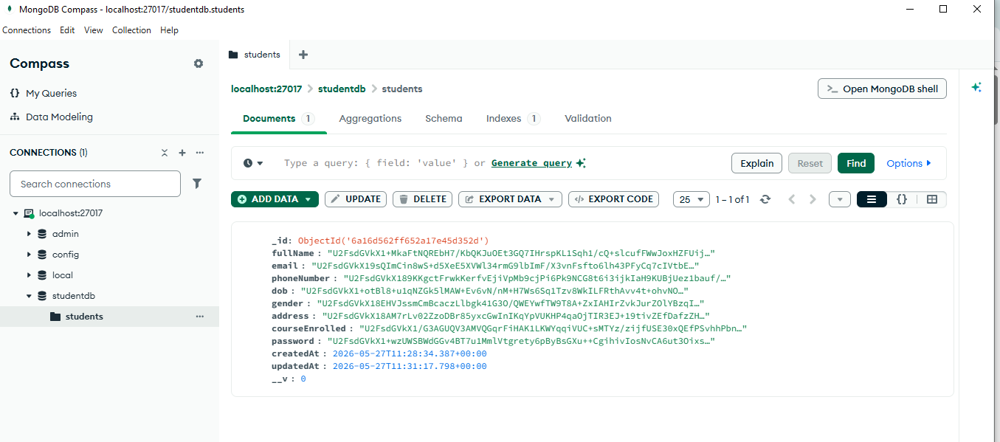
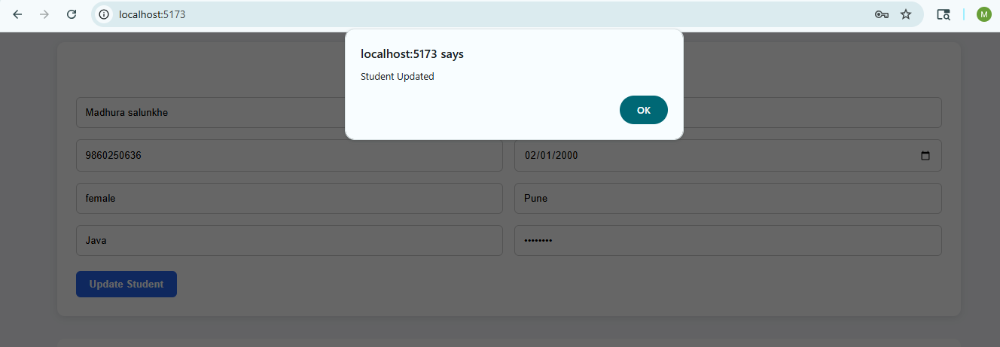
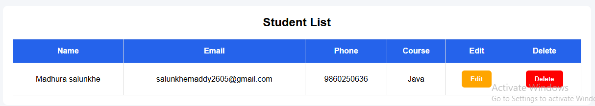
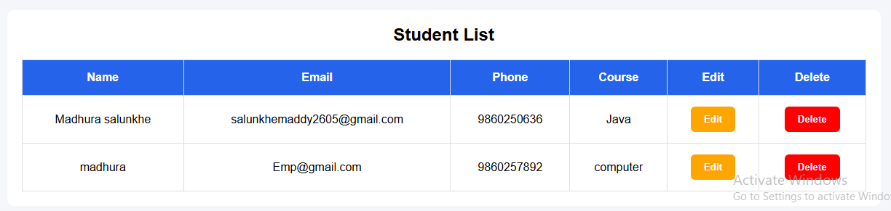
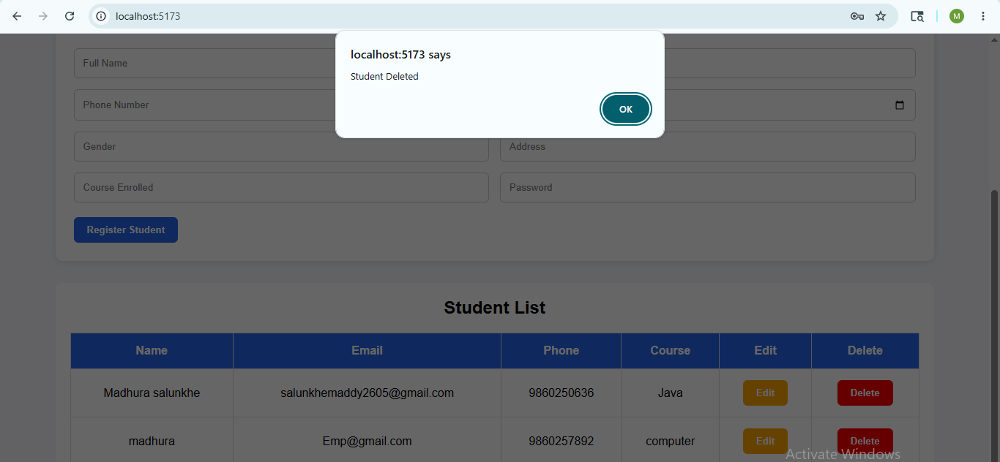
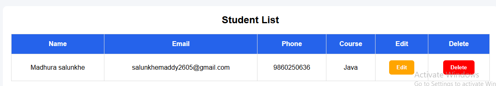

# React + Node TypeScript Student Management System

A full-stack Student Management System built using **React + TypeScript**, **Node.js + Express + TypeScript**, and **MongoDB** with **2-Level AES Encryption** implementation.

---

# Features

- Login Form with Validation
- Student Registration Form
- CRUD Operations
  - Add Student
  - View Students
  - Update Student
  - Delete Student
- Frontend AES Encryption
- Backend AES Encryption
- MongoDB Integration
- Responsive UI
- TypeScript Support

---

# Tech Stack

## Frontend
- React
- TypeScript
- Axios
- React Router DOM
- CryptoJS

## Backend
- Node.js
- Express.js
- TypeScript
- MongoDB
- Mongoose
- CryptoJS

---

# Folder Structure

```bash
task-react-node-typescript/
├── client/
│   ├── src/
│   │   ├── components/
│   │   │   ├── LoginForm.tsx
│   │   │   ├── StudentForm.tsx
│   │   │   └── StudentList.tsx
│   │   ├── pages/
│   │   │   ├── LoginPage.tsx
│   │   │   ├── RegisterPage.tsx
│   │   │   └── StudentsPage.tsx
│   │   ├── utils/
│   │   │   └── crypto.ts
│   │   ├── App.tsx
│   │   └── index.css
│
├── server/
│   ├── src/
│   │   ├── controllers/
│   │   │   └── studentController.ts
│   │   ├── models/
│   │   │   └── Student.ts
│   │   ├── routes/
│   │   │   └── studentRoutes.ts
│   │   ├── utils/
│   │   │   └── crypto.ts
│   │   ├── app.ts
│   │   └── server.ts
│
└── README.md
```

---

# Encryption Flow

## Frontend Encryption

Before sending data to backend:

```text
Original Data
→ Frontend AES Encryption
```

Frontend encrypts each field using CryptoJS AES encryption.

---

## Backend Encryption

Backend receives already encrypted data and applies second encryption layer:

```text
Frontend Encrypted Data
→ Backend AES Encryption
→ MongoDB
```

---

# Decryption Flow

While fetching student data:

```text
MongoDB
→ Backend decrypts one level
→ Sends partially encrypted data
→ Frontend decrypts final level
→ Original data displayed in UI
```

---

# API Routes

## Register Student

```http
POST /api/register
```

## Get All Students

```http
GET /api/students
```

## Update Student

```http
PUT /api/student/:id
```

## Delete Student

```http
DELETE /api/student/:id
```

---

# Setup Instructions

## 1. Clone Repository

```bash
git clone YOUR_GITHUB_REPO_LINK
```

---

## 2. Frontend Setup

```bash
cd client
npm install
npm run dev
```

Frontend runs on:

```text
http://localhost:5173
```

---

## 3. Backend Setup

```bash
cd server
npm install
npm run dev
```

Backend runs on:

```text
http://localhost:5000
```

---

## 4. Environment Variables

Create `.env` file inside `server` folder.

```env
PORT=5000

MONGO_URI=mongodb://127.0.0.1:27017/studentdb

FRONTEND_SECRET=myfrontendsecret

BACKEND_SECRET=mybackendsecret
```

---

# MongoDB

Make sure MongoDB service is running locally.

Database Name:

```text
studentdb
```

---

# Validation Features

- Email format validation
- Password minimum length validation
- Required field handling

---

# Application Screenshots

## Login Page



---

## Student Registration Page



---

## Student Registered Page



---

## Student List Page



---

## MongoDB Database



---

## Student Update Page



---

## Student Updated list

Here I'm updated courseenrolled python with Java



---

## Before Deleting Data Student List

Here before deleting data I'm added new entry



---
## Student Deleted

Here before deleting data I'm added new entry



---
## After Deleting Student List



---

# Author

Madhura Salunkhe
